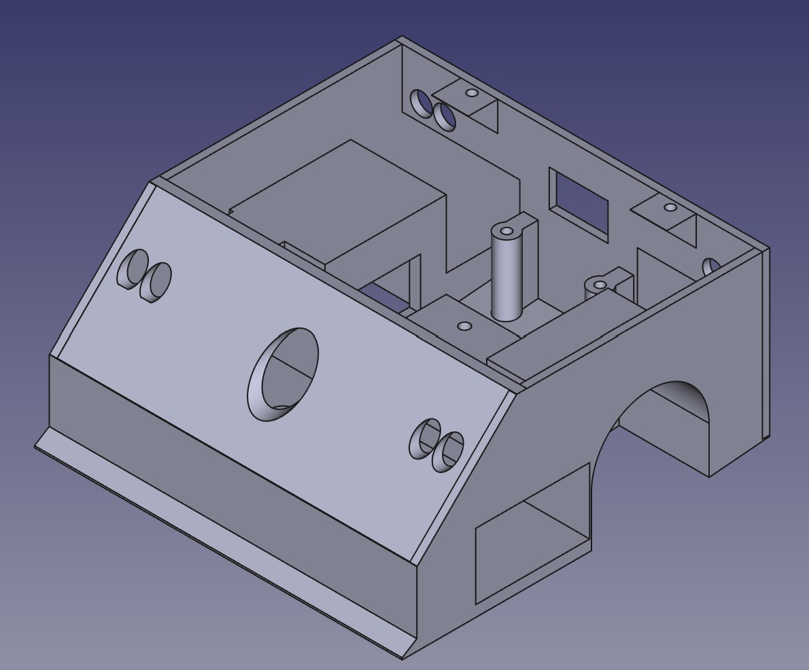
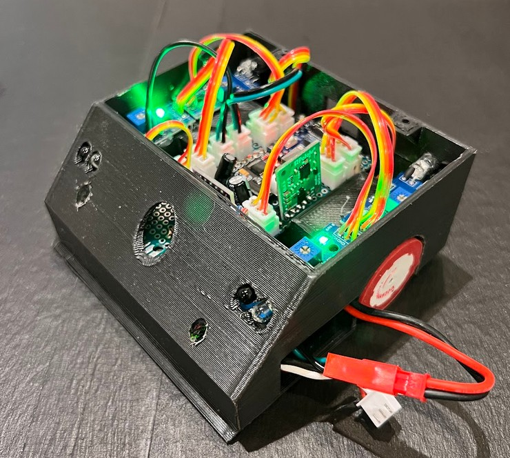
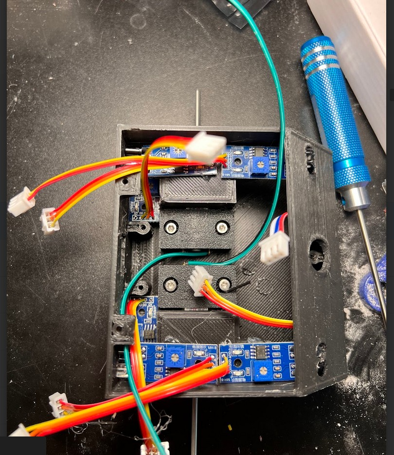
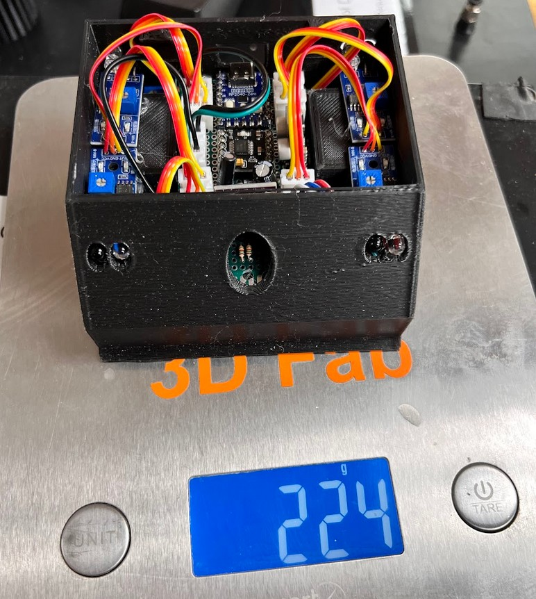
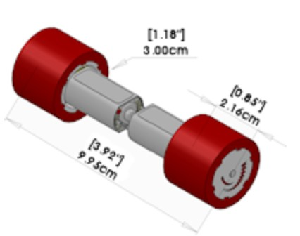
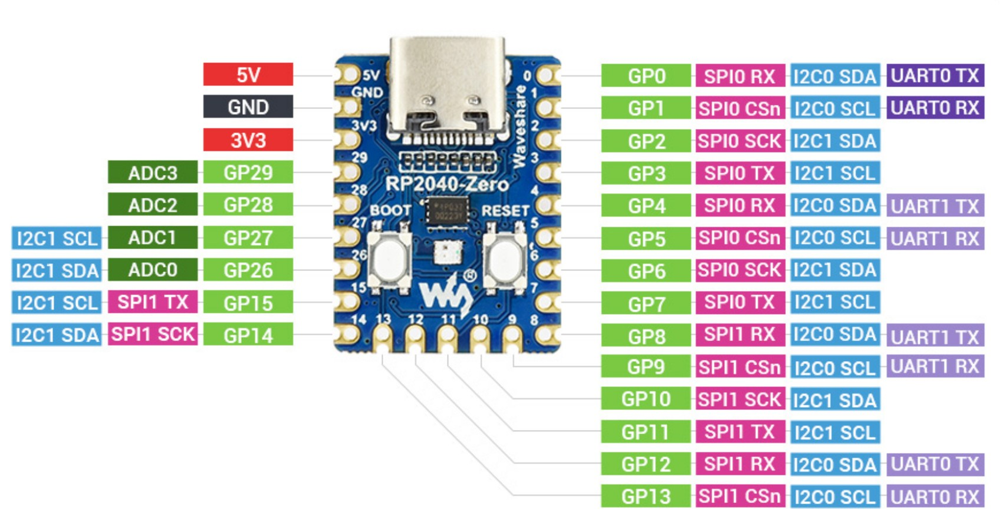
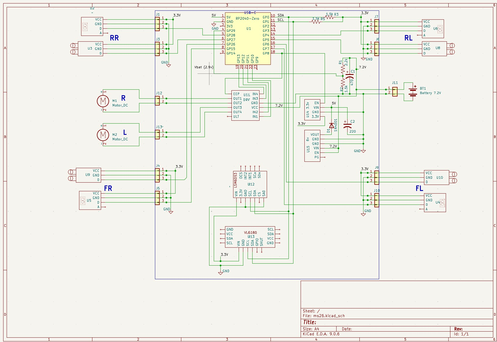

# ms26
Mini Sumo DIY for Spring 2026 RoboRama. 
This is a DIY mini sumo 10cmx10cm robot made with 3D printed body with mounts and "off the shelf" modules and a point to point wired 0.1" bread board to connect it all together. 

# Mechanics
## Body
The body is in 2 parts printed on 3D printer, a main body and a top lid and is created using Matte Black PLA filiment. 
The main body is one piece and has mounts for the motors/wheels and the circuit board and sensors. There is an opening on the side for the battery to be inserted. 
The top lid bolts onto the body and has compartments to put pennys in as weights, there is also a cover to tightly hold the pennys in place. 
3D design using FreeCad: 

The final mini-sumo robot without the lid 

The object and edge sensors are mounted as well as wheels and motors. The motors are bolted into place using a 3D saddle mount 

## Weight
The weight limit is 500 grams. Without a lid it weighs in at about 225 grams.

Hmmm the coffee shop weighed it as 295!!
## Motor
FingerTech "Silver Spark" 16mm Gearmotor 50:1 
<https://www.fingertechrobotics.com/proddetail.php?prod=ft-Sspark16> 

## Wheel
FingerTech Mini-Sumo Wheels (pair) 
<https://www.fingertechrobotics.com/proddetail.php?prod=ft-minisumo-wheels-1125> 
The wheels and motors are made to be used together for the 10cm width on mini-sumo. 
 

## Battery
Amazon Blomiky 7.4V 1200mAH Lipo Battery Pack with JST Plug 
<https://www.amazon.com/dp/B07DB52T49?ref=ppx_yo2ov_dt_b_fed_asin_title> 
The battery can run for hours and supplys a lot of the weight. 

# Circuit modules
## Processor
Waveshare RP2040-Zero, a Pico-like MCU Board Based on Raspberry Pi MCU RP2040, Mini ver 
<https://www.waveshare.com/rp2040-zero.htm> 
 

## 6V regulator
Pololu 6V, 2.7A Step-Down Voltage Regulator D36V28F6 
<https://www.pololu.com/product/3783> 
This supplies power for the processor and 3.3V regulator. The 6V output allows a protection diode while keeping the voltage above 5V 

## 3.3V regulator
SparkFun BabyBuck Regulator Breakout - 3.3V (AP63203) 
<https://www.sparkfun.com/sparkfun-babybuck-regulator-breakout-3-3v-ap63203.html> 
This supplies 3.3V power to the sensors. The 3.3v from the RP2040 module does not have the current rating for the sensors. 
The voltage is enabled using a pin on the RP2040.<>

## Motor driver
Amazon DRV8833 DC Motor Driver Controller Board 1.5A Dual H Bridge 
<https://www.amazon.com/dp/B0DB8CX8LK?ref=ppx_yo2ov_dt_b_fed_asin_title> 
The motor speed is controlled using this PWM library <https://github.com/khoih-prog/RP2040_PWM> 
The driver is enabled using a pin on the RP2040. 

## TOF Range sensor
Adafruit VL6180X Time of Flight Distance Ranging Sensor (VL6180) - STEMMA QT 
<https://www.adafruit.com/product/3316> 
Library <https://github.com/adafruit/Adafruit_VL6180X> 

## Edge detector
Amazon TCRT5000 Infrared Reflective Sensor IR Photoelectric Switch Barrier Line Obstacle Avoidance Module 
<https://www.amazon.com/dp/B08YRCR6ML?ref=ppx_yo2ov_dt_b_fed_asin_title>

## Object detector
Amazon IR Infrared Obstacle Avoidance Sensor Module 2-30cm Adjustable 3.3V-5V 3-Wire Detection  
<https://www.amazon.com/dp/B0FR4MZFMH?ref=ppx_yo2ov_dt_b_fed_asin_title> 

## IMU
Amazon LSM6DS3 6-axis IMU 3-axis Accelerometer 3-axisGyroscope Sensor 6 Degrees of Freedom,Embedded Temperature Sensor, SPI I2C 
<https://www.amazon.com/dp/B0DGQ9533D?ref=ppx_yo2ov_dt_b_fed_asin_title> 
Library <https://docs.arduino.cc/libraries/arduino_lsm6ds3/>  
The library only uses I2C0 (Wire) with a fixed address (not same as the TOF sensor) and fixed update rate of 104 Hz. 

# Circuit board
The circuit board is a 0.1" perf board and is point to point wired. The sensors and motor are connected using locking connectors and the battery wire with a connector on the end is soldered on. 
The battery is managed by reading its voltage on one of the analog A/D input pins using a voltage divider to keep the voltage on the piins less than 3.3V. The 3.3V regulator and motor driver are disabled when the battery voltage is less than 6.6V. 
 

# Mini Sumo Movement
The basic strategy is to move between the edges of the ring and push the opponent off the ring when contacted. 
The motor is geared and has lots of torque for the small motor. The wheels have a lot of surface area and made of silicon giving them a lot of traction. The speed is at 100% when moving edge to edge providing a lot of momentum. 
The bottom sensors on the front sense the edge of the ring and cause the robot to spin around about 180 deg before driving to the edge again. 
 
The front TOF sensor has two purposes: 
- Start/Stop switch 
    To start or stop a finger is held over the sensor hole for at least a second and the action begins when the finger is removed. The start action actually starts a 5 second timer before the robot starts moving as required. 
- Object detection 
    When an object is detected in front (hopefully the competitor) the robot makes sure both bottom front edge detectors are tripped before reversing and spinning. 
 

The front sensors on the left and right cause the robot to steer right or left to enable pushing the opponent better by trying to move to its center.  

# Code
The RP2040 code in C++ is developed using the Arduino IDE and uses both cores. C++ allows extremely fast sensor detection and wheel speed changes of a few thousand per second. To allow the fast edge detection and response the TOF sensor library is a bit slow and seems to only be blocking so it was moved to the 2nd core along with the IMU which shares the I2C bus. A simple FIFO sends the TOF and IMU information to the main core. 

